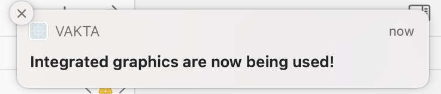
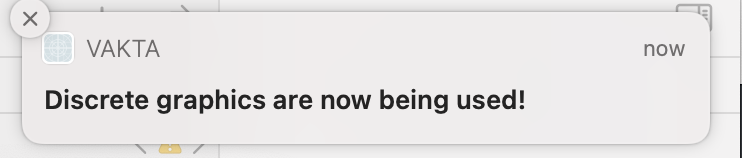

#  Vakta
App that notifies you when your Mac switches between integrated and dedicated graphics.  Only tested for my setup, so usage results for you might vary.

## Usage
1) Build with XCODE
2) Run whatever it spits out.
